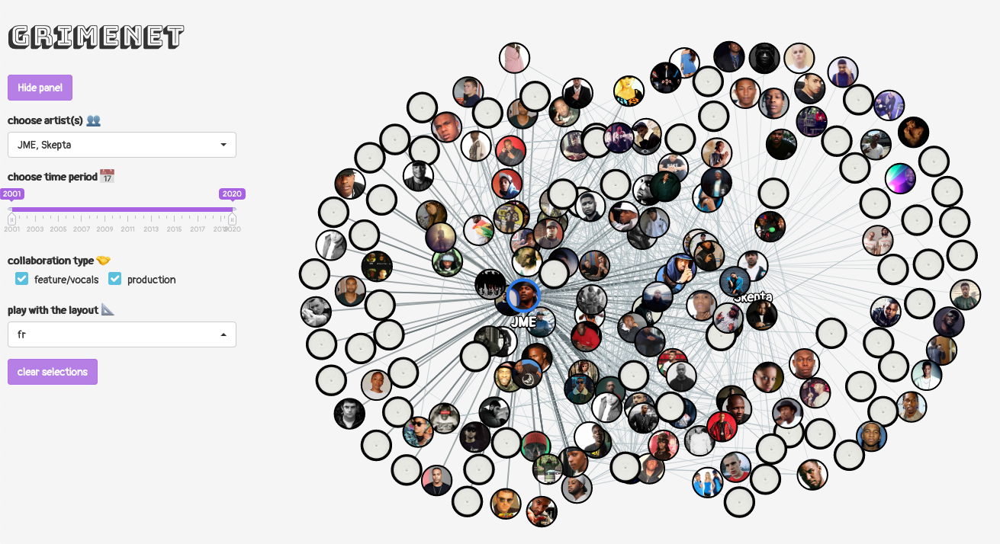

<!-- README.md is generated from README.Rmd. Please edit that file -->

```{r, include = FALSE}
knitr::opts_chunk$set(
  collapse = TRUE,
  comment = "#>",
  fig.path = "man/figures/README-",
  out.width = "100%"
)
```

# grimenet



*GRIMENET* is an app for exploring the social networks within [UK Grime](https://en.wikipedia.org/wiki/Grime_(music_genre)) through interactive network analysis.

## Use

Visit [apps.ewen.io/grimenet](https://apps.ewen.io/grimenet/).

You can also serve the app locally by simply running (inside an R session):

```{r, eval=FALSE}
remotes::install_github("ewenme/grimenet") # install

grimenet::run_app() # run!
```

## Credits

This work is heavily inspired by Karl Tryggvason's [Discogsgrapher](https://github.com/Kalli/Discogsgrapher) project.

## License

[MIT](https://github.com/ewenme/grimenet/blob/master/LICENSE)
