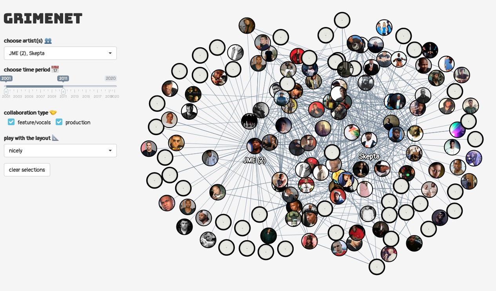

<!-- README.md is generated from README.Rmd. Please edit that file -->

# grimenet

<!-- badges: start -->

[](https://www.tidyverse.org/lifecycle/#experimental)
<!-- badges: end -->



*GRIMENET* is an app for exploring the social networks within [UK
Grime](https://en.wikipedia.org/wiki/Grime_\(music_genre\)) through
interactive network analysis.

## Use

Visit [apps.ewen.io/grimenet](https://apps.ewen.io/grimenet/).

You can also serve the app locally by simply running (inside an R
session):

``` r
remotes::install_github("ewenme/grimenet") # install

grimenet::run_app() # run!
```

## Credits

This work is heavily inspired by Karl Tryggvason’s
[Discogsgrapher](https://github.com/Kalli/Discogsgrapher) project.
